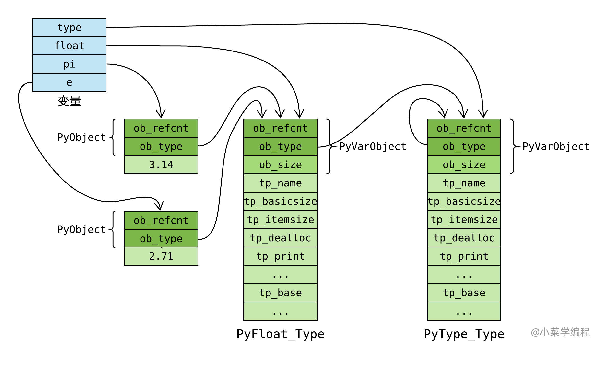
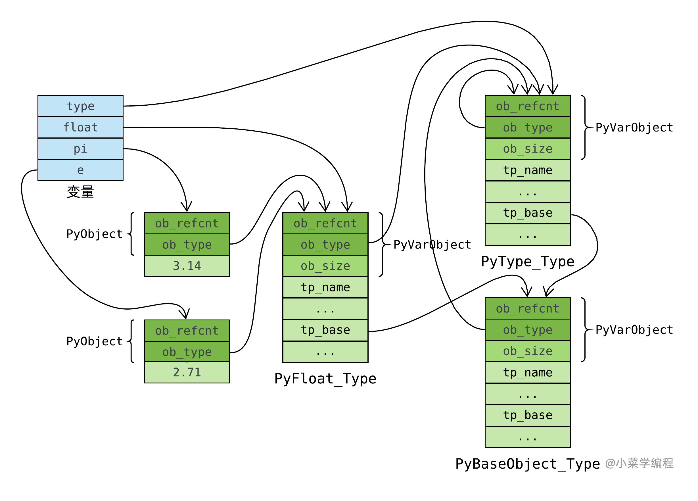

# PyTypeObject

> 本部分内容包含直接转载引用内容，如有侵权请通知

## 类型对象（用于保存某类型信息的结构体）

`PyTypeObject` 是 Python C API 中的一个核心结构体，用于表示 Python 中的类型。每个 Python 对象都有一个类型，而这个类型就是由 `PyTypeObject` 结构体表示的。

### 结构定义

`PyTypeObject` 结构体的定义如下：

```c
typedef struct _typeobject {
    PyObject_VAR_HEAD
    const char *tp_name; /* 类型名称 */
    Py_ssize_t tp_basicsize, tp_itemsize; /* 对象的基本大小和项大小 */
    /* 方法集 */
    destructor tp_dealloc;
    printfunc tp_print;
    getattrfunc tp_getattr;
    setattrfunc tp_setattr;
    /* ... 其他方法 ... */
    hashfunc tp_hash;
    /* 类型比较函数 */
    comparisonfunc tp_compare;
    /* 类型转换函数 */
    convertfunc tp_as_number;
    tp_as_sequence;
    tp_as_mapping;
    /* ... 其他属性 ... */
    struct _typeobject *tp_base; /* 基类 */
    PyObject *tp_dict; /* 类的字典 */
    /* ... 其他字段 ... */
} PyTypeObject;
```

### 主要字段

- `tp_name`：类型的名称，如 `"int"`, `"str"` 等。
- `tp_basicsize`：对象的基本大小（不包括可变部分）。
- `tp_itemsize`：如果类型表示一个数组或类似数组的对象，此字段表示每个项的大小。
- `tp_dealloc`：对象的析构函数。
- `tp_print`：对象的打印函数。
- `tp_getattr` 和 `tp_setattr`：对象的属性访问函数。
- `tp_hash`：对象的哈希函数。
- `tp_compare`：对象的比较函数。
- `tp_as_number`, `tp_as_sequence`, `tp_as_mapping`：对象作为数字、序列、映射时的操作函数。
- `tp_base`：基类类型对象。
- `tp_dict`：类型的命名空间字典，包含类型的属性和方法。

### 动态类型系统

Python 的类型系统是动态的，允许在运行时创建和修改类型。通过 `PyTypeObject` 结构体，Python C API 提供了创建新类型、修改现有类型以及查询类型信息的接口。

## Py(Typename)Object

其中(Typename)是可以替换位类型名称，比如int类型可以替换为PyLongObject，他们才是真正存放变量信息的结构体

> **Py(Typename)Object和PyTypeObject的区别**
>
> `PyLongObject` 是一种具体的对象类型，而 `PyTypeObject` 则描述了这种类型的元数据。具体关系如下：
>
> - **类型描述**: `PyLongObject` 的 `ob_type` 字段指向 `PyLong_Type`，这是一个 `PyTypeObject` 实例。`PyLong_Type` 定义了长整数的所有属性和方法，例如加法、减法、乘法等操作。
> - **继承关系**: 在 Python 的类型体系中，所有的对象都继承自 `PyObject`，而 `PyObject` 包含一个指向 `PyTypeObject` 的指针。`PyLongObject` 继承自 `PyObject`，因此它也有一个 `ob_type` 字段指向其类型对象 `PyLong_Type`。
> - **动态类型系统**: Python 的动态类型系统依赖于 `PyTypeObject` 来在运行时确定对象的类型，并调用相应的操作。当你对一个长整数进行操作时，Python 会通过 `ob_type` 找到 `PyLong_Type`，然后调用其定义的方法来执行操作。

## 用C创建一个Python的类型

以下是一个简单的示例，展示如何使用 `PyTypeObject` 创建一个新的 Python 类型：

我们先根据结构的声明我们的新类型

```python
#include <Python.h>

typedef struct {
    PyObject_HEAD
    int value;
} MyIntObject;

static PyTypeObject MyIntType = {
    PyVarObject_HEAD_INIT(NULL, 0)
    .tp_name = "myint.MyInt",
    .tp_basicsize = sizeof(MyIntObject),
    .tp_flags = Py_TPFLAGS_DEFAULT,
    .tp_new = MyInt_new,
    .tp_init = (initproc)MyInt_init,
    .tp_members = MyInt_members,
};
```

如何在结构体后跟上我们新创建类型的方法

```c
static PyObject* MyInt_new(PyTypeObject *type, PyObject *args, PyObject *kwds) {
    MyIntObject *self;
    self = (MyIntObject *)type->tp_alloc(type, 0);
    if (self != NULL) {
        self->value = 0;
    }
    return (PyObject *)self;
}

static int MyInt_init(MyIntObject *self, PyObject *args, PyObject *kwds) {
    static char *kwlist[] = {"value", NULL};
    if (!PyArg_ParseTupleAndKeywords(args, kwds, "i", kwlist, &self->value))
        return -1;
    return 0;
}

static PyMemberDef MyInt_members[] = {
    {"value", T_INT, offsetof(MyIntObject, value), 0, "integer value"},
    {NULL}  /* Sentinel */
};


static PyModuleDef myintmodule = {
    PyModuleDef_HEAD_INIT,
    .m_name = "myint",
    .m_doc = "Example module that creates an extension type",
    .m_size = -1,
};

```

加载类型

```python
PyMODINIT_FUNC PyInit_myint(void) {
    PyObject *m;
    if (PyType_Ready(&MyIntType) < 0)
        return NULL;
    m = PyModule_Create(&myintmodule);
    if (m == NULL)
        return NULL;
    Py_INCREF(&MyIntType);
    PyModule_AddObject(m, "MyInt", (PyObject *)&MyIntType);
    return m;
}
```


## PyType_Type，类型的类型

我们初步考察了 *float* 类型对象，知道它在 *C* 语言层面是 *PyFloat_Type* 全局静态变量。 类型是一种对象，它也有自己的类型，也就是 *Python* 中的 *type* ：

```python
>>> float.__class__
<class 'type'>
```

那么， *type* 在 *C* 语言层面又长啥样呢？

围观 *PyFloat_Type* 时，我们通过 *ob_type* 字段揪住了 *PyType_Type* 。 的确，它就是 *type* 的肉身。 *PyType_Type* 在 *Object/typeobject.c* 中定义：

```c
PyTypeObject PyType_Type = {
    PyVarObject_HEAD_INIT(&PyType_Type, 0)
    "type",                                     /* tp_name */
    sizeof(PyHeapTypeObject),                   /* tp_basicsize */
    sizeof(PyMemberDef),                        /* tp_itemsize */
    (destructor)type_dealloc,                   /* tp_dealloc */

    // ...
    (reprfunc)type_repr,                        /* tp_repr */

    // ...
};
```

内建类型和自定义类对应的 *PyTypeObject* 对象都是这个通过 *PyType_Type* 创建的。 *PyType_Type* 在 *Python* 的类型机制中是一个至关重要的对象，它是所有类型的类型，称为 **元类型** ( *meta class* )。 借助元类型，你可以实现很多神奇的高级操作。

注意到， *PyType_Type* 将自己的 *ob_type* 字段设置成它自己(第 *2* 行)，这跟我们在 *Python* 中看到的行为是吻合的：

```python
>>> type.__class__
<class 'type'>
>>> type.__class__ is type
True
```

至此，元类型 *type* 在对象体系里的位置非常清晰了：



## PyBaseObject_Type，类型之基



## 引用

>  [类型之基](https://fasionchan.com/python-source/object-model/pyobject/#pybaseobject_type)

