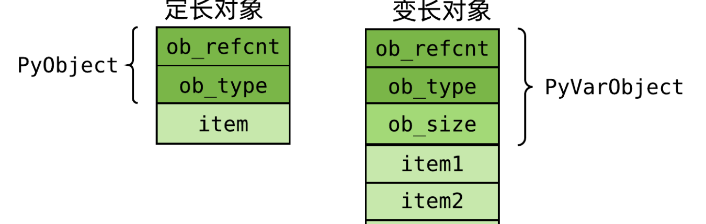
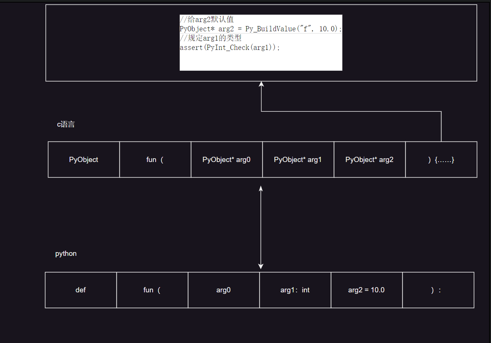

# PyObject

​    所有的对象在Python解释器中都被表示成PyObject，PyObject结构包含Python对象的所有成员指针，并且对Python对象的类型信息和引用计数进行维护。在进行Python的扩展编程时，一旦要在C或者C++中对Python对象进行处理，就意味着要维护一个PyObject结构。

> 为了简化内存管理，Python通过引用计数机制实现了自动的垃圾回收功能，Python中的每个对象都有一个引用计数，用来计数该对象在不同场所分别被引用了多少次。每当引用一次Python对象，相应的引用计数就增1，每当消毁一次Python对象，则相应的引用就减1，只有当引用计数为零时，才真正从内存中删除Python对象。
>
> 下面的例子说明了Python解释器如何利用引用计数来对Pyhon对象进行管理：
>
> ```
> 例1:refcount.py
> class refcount:
>     # etc.
> r1 = refcount() # 引用计数为1
> r2 = r1         # 引用计数为2
> del(r1)         # 引用计数为1
> del(r2)         # 引用计数为0，删除对象
> 
> ```
>
> 在C/C++中处理Python对象时，对引用计数进行正确的维护是一个关键问题，处理不好将很容易产生内存泄漏。Python的C语言接口提供了一些宏来对引用计数进行维护，最常见的是用Py_INCREF()来增加使Python对象的引用计数增1，用Py_DECREF()来使Python对象的引用计数减1。

   在Python的C语言扩展接口中，大部分函数都有一个或者多个参数为PyObject指针类型，并且返回值也大都为PyObject指针。

## 定长对象结构定义（int/float/……）

在 C 语言层面，`PyObject` 的定义如下：

```c
typedef struct _object {
    _PyObject_HEAD_EXTRA
    Py_ssize_t ob_refcnt;
    struct _typeobject *ob_type;
} PyObject;
```

- `_PyObject_HEAD_EXTRA`：用于支持活动堆对象的双向链表，仅在编译时定义了 `Py_TRACE_REFS` 宏时才会包含。
- `ob_refcnt`：引用计数，记录当前对象被引用的次数。
- `ob_type`：指向 `PyTypeObject` 的指针，表示对象的类型。

## 变长对象结构定义（list/dictionary/……）

```python
typedef struct {
    PyObject ob_base;
    Py_ssize_t ob_size; /* Number of items in variable part */
} PyVarObject;
```

- `obsize`用于记录元素个数



## C和python函数之间的关系

通过这个图可以看过python是如何用PyObject结构体实现多类型、不定变量的



## 引用

>  [揭开 Python 对象神秘的面纱 | Python源码剖析 (fasionchan.com)](https://fasionchan.com/python-source/object-model/pyobject/#google_vignette)
