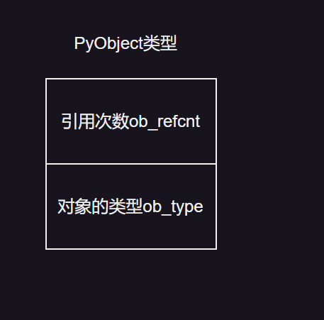
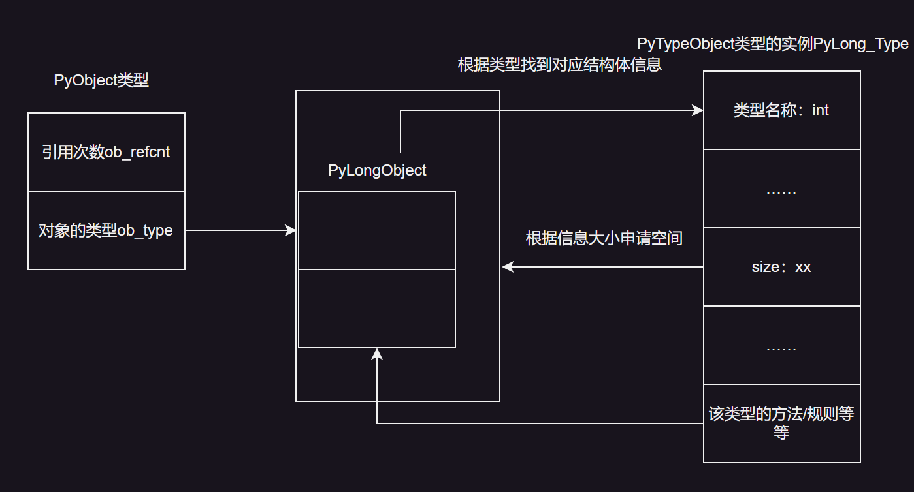

# 类型和底层结构的关系

​    相信看到这里的师傅们估计头的大了，什么PyTypeObject、PyObject的，乱七八糟的，别着急，这章给大家缕一缕。

​      我们从创建一个变量开始，一步步的解析其中的关系

```python
i = int(1)
```

当我们创建这个变量的时候，我们会先对这个变量生成一个对象，也就是一个PyObject的实例，它包含了引用次数和这个对象的类型。



​    其中对象的类型就是Py(Typename)Object，比如PyLongObject等等，这时候出现一个问题，PyLongObject这个结构体的大小是多少？它有什么内容？这时候PyTypeObject便登场了，PyTypeObject是python自带的一个结构，并且在虚拟机启动时就已经加载好了多个实例，其中包含着PyLongObject、PyFloatObject、PyDoubleObject等多个实例。这些实例都包含着他们对应Py(Typename)Object结构体的信息。



