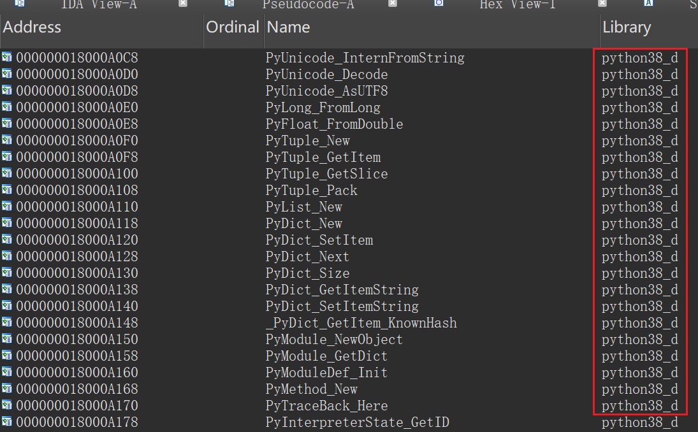
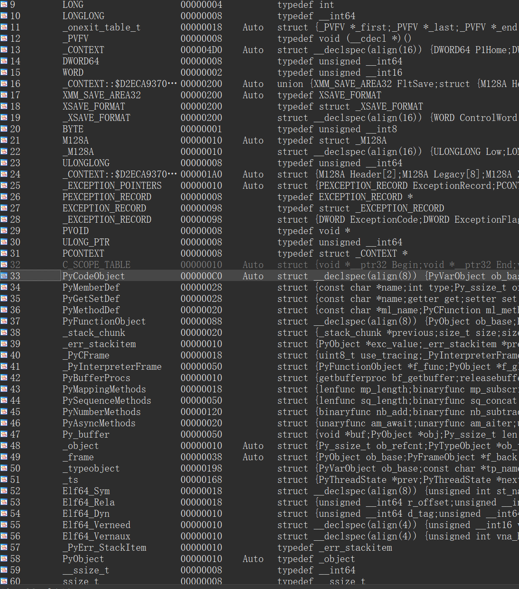

# 开始逆向实战

​    学习完前几章的知识，那么我们现在可以正式开始我们的逆向之路了。先声明一下后续章节讲述方法的变动，在接下来的几章中，教程将先从常见的固定结构进行分析，然后在到常见的数据结构，其中还会穿插着一些对应逆向的例子。

## Pyd逆向的准备工作

在此之前，我们先学习一下怎么将对应版本的python信息导入一下python的结构体

首先在导入表中明确要生成python头的版本



然后自己选择对应版本的python随意生成一个debug版的pyd（可以参考[1.1认识python生成的文件](./1.1认识python生成的文件.md)提供的方法），并用ida打开，导出对应的结构体 

```
File->Produce File->Create C Header File
```

然后把刚刚导出的.h文件导入到要逆向的ida中

```
File->Load File->Parse C Header File
```

此时就可以在导入ida的Local Types里看到了，双击就可以把选中的结构体导入到ida里



>  **这里有两个要注意的事情！！！**
>
> 如果使用Window导出的.h文件往往会有很多错误，需要删掉大量的垃圾信息后才能执行
>
> 其次如果自己想要导出结构体，那么一定要把`.h` 其中的__pyx_mstate_global结构体删除，因为这个结构体的内容取决于python的变量内容，并不具备普适性，至于如何生成，可以参考 [3.1pyd_so逆向——变量](./3.1pyd_so逆向——变量.md)

## Pyc逆向的准备工作🚧

## PythonExe逆向的准备工作🚧