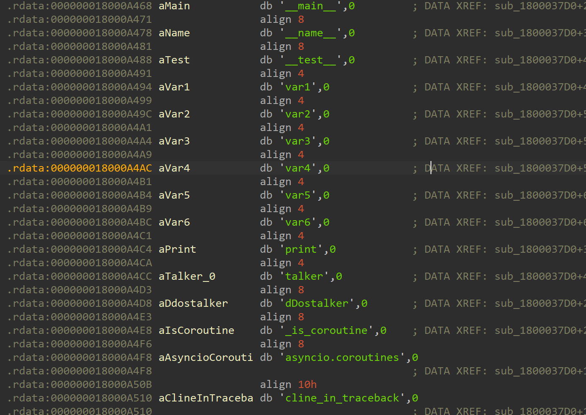
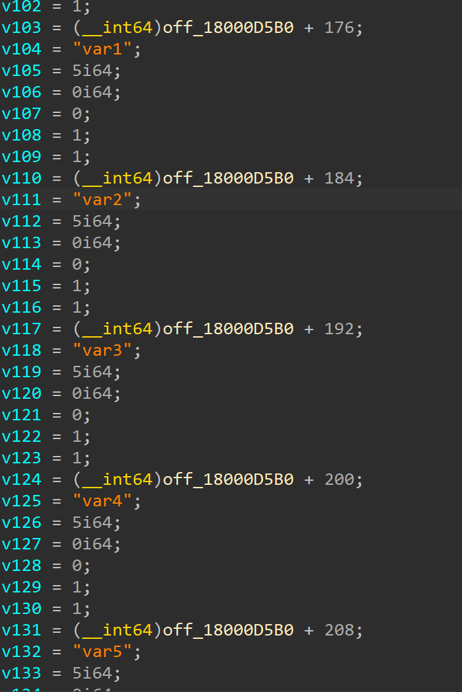

# pyd_so逆向——变量

​    对于编程语言来说，变量和常量是一个语言必不可少的一部分，不论是基础逆向还是深入逆向，都有着它的身影，知道一个功能用了什么变量将是我们逆向的关键步骤。

## 测试pyd程序

​    要射箭先画靶，为了更好的研究pyd程序是怎么储存变量的，我们需要先自己生成一个目标pyd程序，这是我写的一个小例子

```python
def dDostalker():
  var1 = int(1)
  var2 = float(2.0)
  var3 = str("3")
  var4 = [4,4.0,'4',[4]]
  var5 = (5,5.0,'5',5,5)
  var6 = {6:'6'}

  print(var1,var2,var3,var4,var6,var5)
```

​    这是一个简单的定义变量并打印的函数，写完后我们根据前面几章写的步骤编译一个pyd出来，然后放入ida当中，但是打开ida的那一刻傻眼了，里面那么多信息，我们该如何去寻找变量呢？别急，我们先看一个结构体。

## `__pyx_mstate`/`__pyx_mstate_global`结构体

​    看到这里，我相信聪明的师傅以及猜到这个结构体的作用了，没错，`__pyx_mstate`结构体就是存放程序用到的python变量(C语言中以PyObject*结构存储)，`__pyx_mstate_global `是一个 `__pyx_mstate `类型的全局变量指针，用来存放变量，需要注意的是，这个结构体的内容不是一成不变的，它会随着pyd中变量的改变而进行改变，所以这也就是为什么在导出python的结构体时需要删除`__pyx_mstate`的原因。

定义：

```c
static __pyx_mstate *__pyx_mstate_global
= &__pyx_mstate_global_static;
```


示例：某程序的__pyx_mstate_global的结构体

```c
typedef struct {
  PyObject *__pyx_kp_b_0;
  PyObject *__pyx_kp_b_1;
  PyObject *__pyx_kp_b_123;
  PyObject *__pyx_kp_b_123456;
  PyObject *__pyx_kp_s_12345678;
  PyObject *__pyx_kp_b_9fbd1425d51c4a1d;
  PyObject *__pyx_kp_s_ABCDEFGHIJKLMNOPQRSTUVWXYZabcdef;
  PyObject *__pyx_n_s_AES;
  PyObject *__pyx_n_s_ARC4;
  PyObject *__pyx_kp_s_Ajc2AYK2Bjg;
  PyObject *__pyx_n_s_Blowfish;
  PyObject *__pyx_kp_s_CDEFGHIJKLMNOPQRSTUVWXYZABabcdef;
  PyObject *__pyx_n_s_ChaCha20;
    ......
}__pyx_mstate;
```

ok，虽然我们知道了这个结构体了，但是找到他又成为了新的问题，找到他也总不可能靠蒙吧，我们如何去找变量到变量呢？欸，有一个函数倒是提供信息给了我们，`_Pyx_CreateStringTabAndInitStrings`函数，这个函数关联字符串与`__pyx_mstate`的成员，把字符串插入到_`_pyx_string_tab`，而**在python中，变量名都会作为字符串储存在计算机本身**，我们不仅可以通过它找到`mastate`，还可以通过此函数内容还原部分`__pyx_mstate`成员名称，也就是python中的变量名

于是，我们查找变量就是如下的流程

## 复原变量

### 定位_Pyx_CreateStringTabAndInitStrings函数

在_Pyx_CreateStringTabAndInitStrings函数中，储存着python的变量，而其中有几个变量是必不可少的，比如：`__main__`
,`__name__`,`__test__`以及`asyncio.coroutines`，我们使用shift+f12直接进行搜索以上的其中几个，基本上就可以定位到储存他们的地址处



交叉引用查看即可定位到定位`__Pyx_CreateStringTabAndInitStrings`函数



​    然后我们根据它的排布创建一个`__pyx_mstate/__pyx_mstate_global`结构体，创建结构体的具体方法是：以off_xxxx为开始，没有填入名称的默认写为空，剩下的根据给的信息名放入 `PyObject* 变量名`直至没有可以继续放入的变量。

​    便捷起见，我使用idapython编写了一个脚本，这个脚本可以直接找到函数`__Pyx_CreateStringTabAndInitStrings`并进行重命名，并且根据他的内容生成对应的结构体到LocalType。脚本见附件3中。当然，这个脚本不是100%正确的，并且只有relase编译的才会有高成功率，部分情况还需要师傅们手动修改。

> 使用方法：
>
> 首先确保你已经导入了PyObject，然后运行command sprict执行代码，之后就可以在Local Type里看到mstate和`__pyx_mstate_gloabl`两个结构体，双击即可导入即可，之后把mastate结构体套给off_xxxxx这个变量就行了

## 确定变量使用位置

​    最好的办法就是对着`__pyx_mstate_global`进行检查交叉引用了，但是会出现很多并不相干的函数干扰，这里提供以下方法

- 调用的地址一定比`Pyx_CreateStringTabAndInitString`地址大

- 调用的函数中往往出现以下类型的代码（这个原因后面会提到）

  

  ```c
   sub_180006240("init rand0m", v6, v5, "rand0m.pyx");
  ```


## 查看变量的赋值

看到这里，先推荐大家再复习一下 [Python和C对接的类型](./2.0Python和C对接的类型.md)章节内的内容

既然看完原理和正向声明，我们来看一下在逆向中他们的区别，在逆向中，**只有基础类型的声明时赋值和正向不同**，元组、列表、字典大致相同。

### Int和Float

在pyd_so中，如果我们在模块里定义了一个变量，且有初始值，那么这个变量的内容将会在`_Pyx_InitConstants()`函数中进行初始化，我们可以通过查看`__Pyx_CreateStringTabAndInitStrings`的交叉引用来找到这个函数（一般情况下这个函数的名称是乱码），这个函数的代码结构大体是这样的

```c
__int64 sub_180005C30()
{
  __int64 v0; // rax
  __int64 v1; // rax
  __int64 v2; // rax
  __int64 v3; // rax
  __int64 v4; // rax
  __int64 v5; // rax

  if ( (int)sub_180005F00() < 0 )
    return 0xFFFFFFFFi64;
  v0 = PyFloat_FromDouble();
  *((_QWORD *)off_18000A818 + 29) = v0;
  if ( !v0 )
    return 0xFFFFFFFFi64;
  v1 = PyFloat_FromDouble();
  *((_QWORD *)off_18000A818 + 30) = v1;
  if ( !v1 )
    return 0xFFFFFFFFi64;
  v2 = PyLong_FromLong(1i64);
  *((_QWORD *)off_18000A818 + 31) = v2;
  if ( !v2 )
    return 0xFFFFFFFFi64;
  v3 = PyLong_FromLong(4i64);
  *((_QWORD *)off_18000A818 + 32) = v3;
  if ( !v3 )
    return 0xFFFFFFFFi64;
  v4 = PyLong_FromLong(5i64);
  *((_QWORD *)off_18000A818 + 33) = v4;
  if ( !v4 )
    return 0xFFFFFFFFi64;
  v5 = PyLong_FromLong(6i64);
  *((_QWORD *)off_18000A818 + 34) = v5;
  return (unsigned int)(v5 != 0) - 1;
}
```

其中我们只需要猜到PyLong_From(Typename)()这个函数就好了，它会读**入一个C的类型，然后变成我们之前所说的那一类Type，最后返回一个PyObject传入我们变量的地址里**。而C类型里的值就是最终赋值到对应python里的值，唯一的问题就是这里的浮点类型可能不容易被反汇编，需要我们汇编查看C的汇编，我相信逆向的师傅们应该都能完成这一任务。