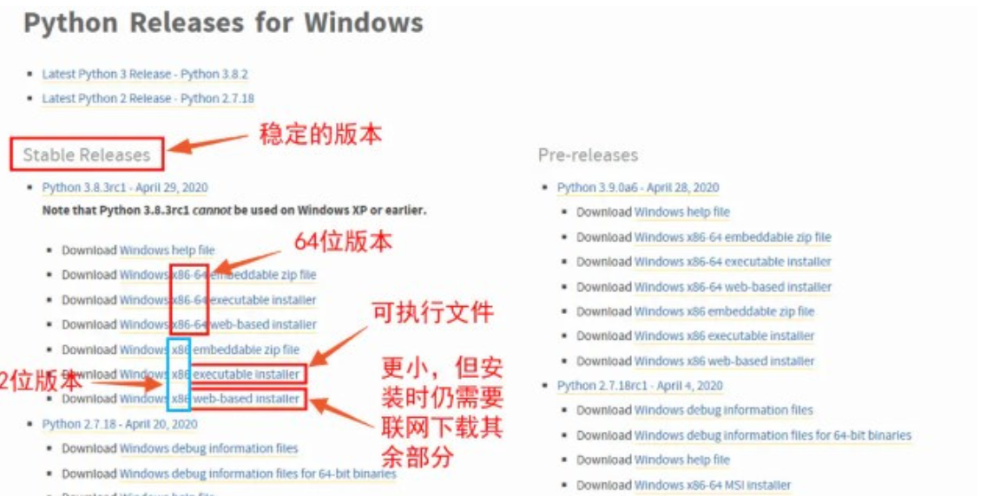
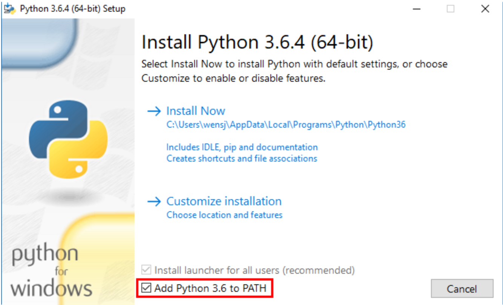

# 附件2：python安装配置表

## 下载

## 安装设置

记的设置环境到path中

其中这一步是最关键的，这两个是为pyd生成debug的补充，**如果没有点上无法生成debug的pyd！！！**

这两个一定要勾上！！！否则在生成pyd的debug文件时会报错

## 引用

> [Python安装教程，超详细！！！-CSDN博客](https://blog.csdn.net/maiya_yayaya/article/details/131450517)
